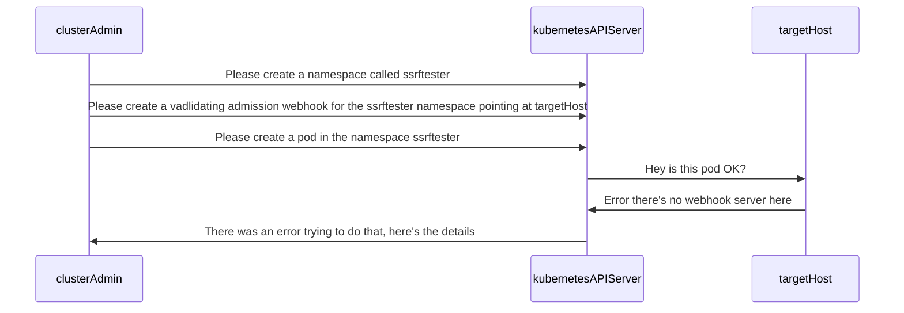

# k8s_ssrf_portscanner

This is a Proof of concept idea for using the Kubernetes API server as a port scanner via SSRF. This is a very simple PoC and is not intended to be used in production!

There are a couple of objects in the Kubernetes API which take a parameter of a URL or service object, which cause the API server to make requests, and they can return errors if the request fails. This can be used to scan for open ports on hosts that the API server can reach.

From a security perspective, to use this you need considerable rights to the Kubernetes API, so it's not likely to be a huge concern, although it does mean, in managed Kubernetes environments, you can port-scan the CSP network. Obviously, we'd expect their security architecture to be pretty good, so port scanning shouldn't reveal anything sensitive :)

## Validating Webhook

This is the initial idea I've implemented. Validating admission webhooks take a service object or URL parameter as part of their configuration and then call that service or URL whenever a matching operation occurs.

Obviously, from a cluster availability perspective, we want to scope down the webhooks sphere of operations so it doesn't disrupt the cluster you're scanning, so what we do is create a namespace with a specific name and then have the webhook only look at create pod attempts in that namespace.

Then, when we try to create a pod in the namespace, the error message that is returned gives us information about the service or URL that the API Server tried to call.

The sequence of events is:

- Check if the namespace exists, if not create it
- Check if the webhook exists, if it does delete it, if not create it.
- Create a pod in the namespace
- Check the error message returned by the API server when it tries and fails to call the target admission webhook
  - Return this to the user after interpreting the error for what it indicates
- Delete the webhook and the namespace

## Sequence diagram

## Usage

`k8s-ssrf-portscanner vwebhookscan` is the command to run the validating webhook scanner. This will (by default) target 127.0.0.1:443 (from the perspective of the API server). You can change the target with `-t` and the port with `-p`. Also if you want to generate a different namespace than the default (`ssrfscanner`) you can use `-n`.

## Usage restrictions

If you run multiple instances of the tool or run a new one immediately after the last one, you'll get an error, as described [here](https://github.com/raesene/k8s_ssrf_portscanner/issues/1). I'll likely implement one or more of the options here to stop that.

## TODO

At the moment we scan individual ports on individual hosts. Obviously it would be better to scan a range of ports on a range of hosts, so we'd need to take the range and then iterate over the scanning process for each one. 

Also reporting is just to STDOUT right now, it could be made more useful with JSON output.

It would be good to add a faster timeout to the webhook, to speed up scanning. Realistically a couple of seconds should do in most cases.
